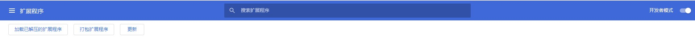
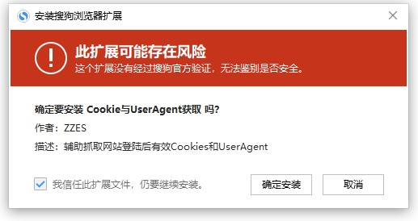
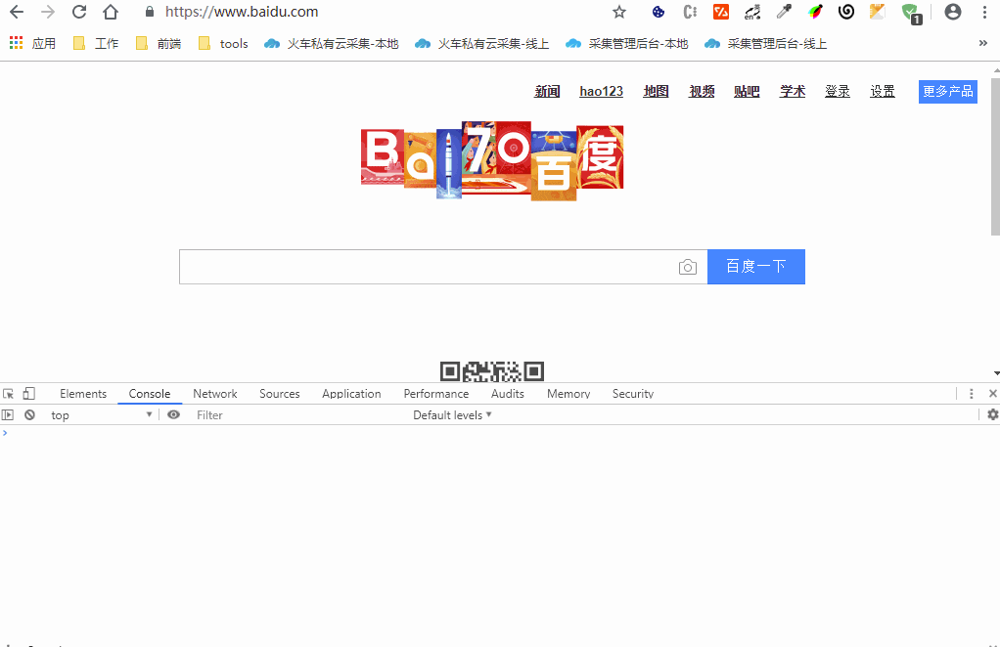
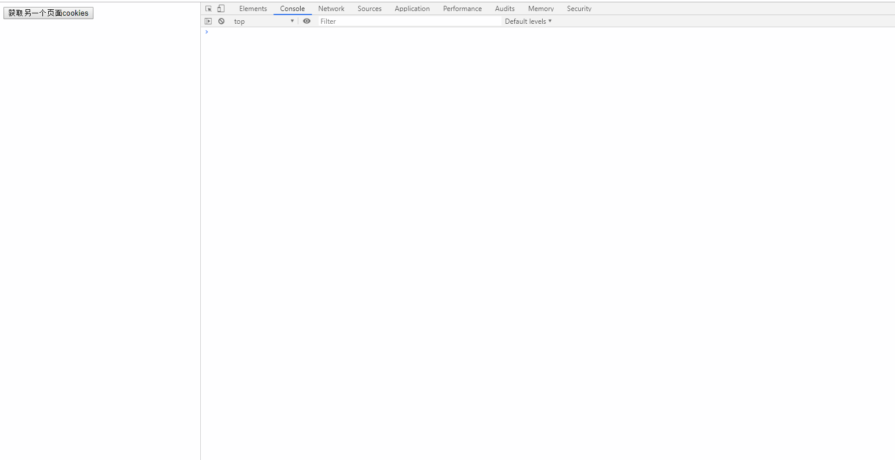

# 浏览器插件获取Cookie与UserAgent
> 火狐商店地址: https://addons.mozilla.org/zh-CN/firefox/addon/cookies%E4%B8%8Euseragent%E8%8E%B7%E5%8F%96/
> 
> EDGE商店地址: https://microsoftedge.microsoft.com/addons/detail/cookie%E4%B8%8Euseragent%E8%8E%B7%E5%8F%96/cnekpflpbekhhpcmaekfdnmoimfhllpc

## 打包插件
```bash
npm install
node package.js
```

## 谷歌导入插件
在扩展程序中, 开启`开发者模式`, 点击`加载已解压的扩展程序`, 导入`extension`文件夹


## 国产浏览器
直接将`crx/GetCookiesAndUserAgent.crx`拖入浏览器即可安装
搜狗浏览器为例


## 功能
### 1.右键复制当前页Cookies

>演示图片


### 2.右键复制当前页UserAgent

>演示图片



### 3.右键将Cookies和UserAgent发送到主页面
主页面需要先发送 message 给插件, 缓存页面 tabId
```javascript
window.parent.postMessage({type: 'tab', level: 'main'}, '*');
```
然后在要获取Cookie与UserAgent的页面右键选择"发送Cookies和UA到主页面"

主页面只需要通过mutationObserver监听 id 为 "cookie-block" 的DOM元素变化即可
```javascript
const cookiesBlock = document.getElementById('cookie-block')
if (!cookiesBlock) return
const config = {
  attributes: true,
  childList: true,
  subtree: true
}
const callback = function(mutationsList, observer) {
  for (let mutation of mutationsList) {
    if (mutation.type === 'childList') {
      console.log(JSON.parse(cookiesBlock.innerText))
    }
  }
}
const observer = new MutationObserver(callback)
observer.observe(cookiesBlock, config)
```

>演示图片

